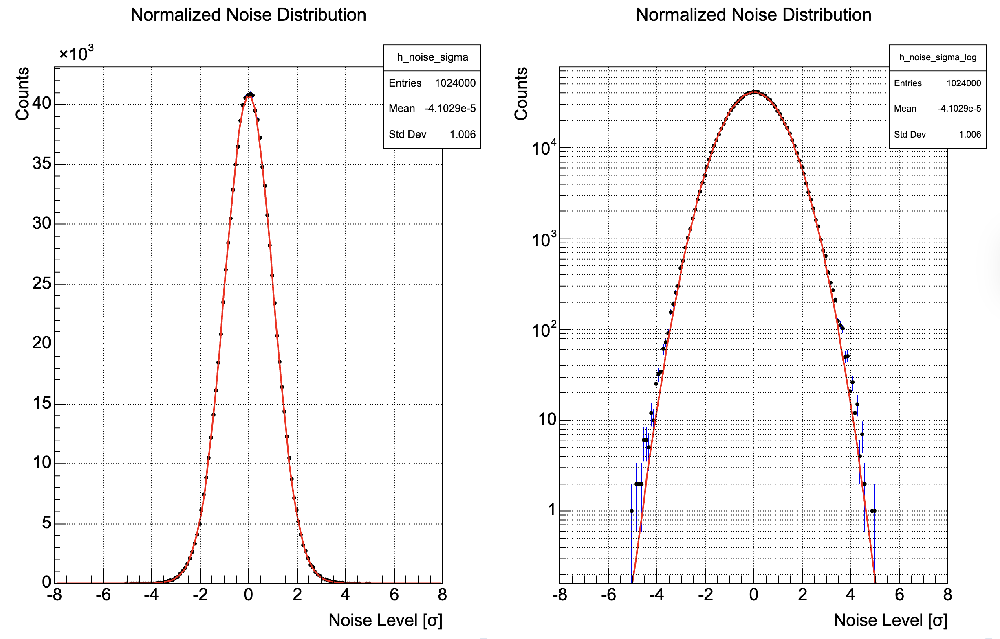
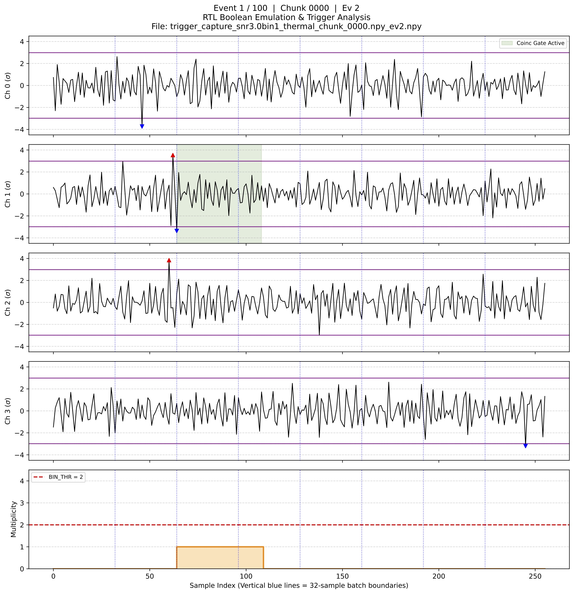
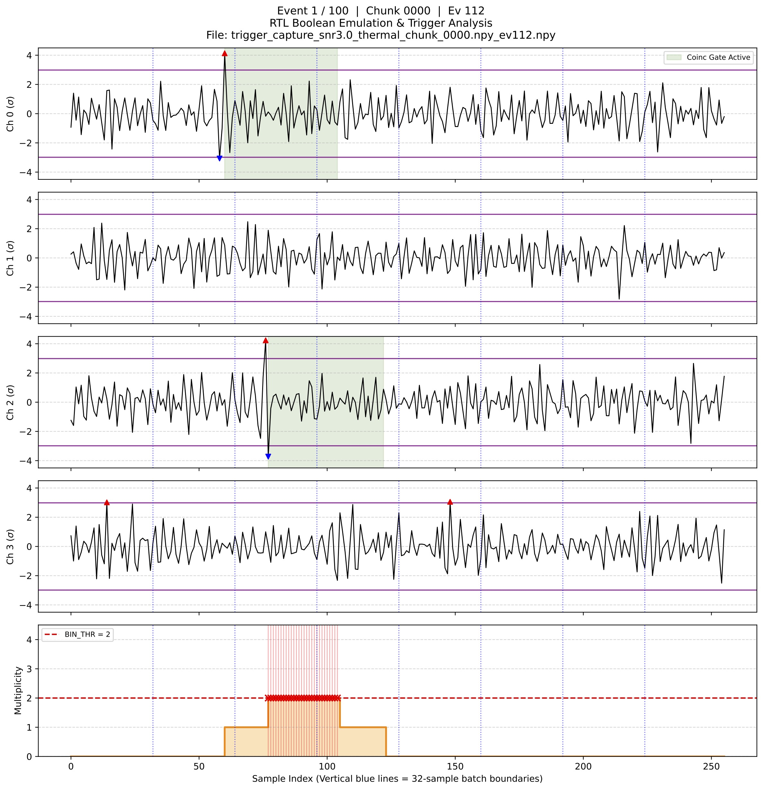
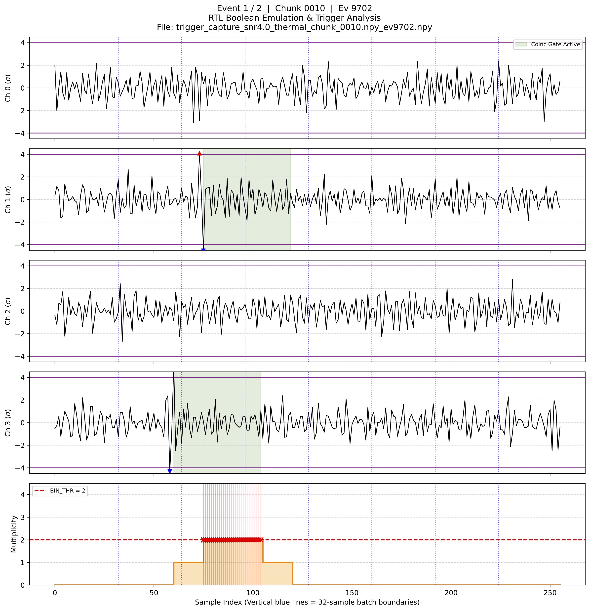
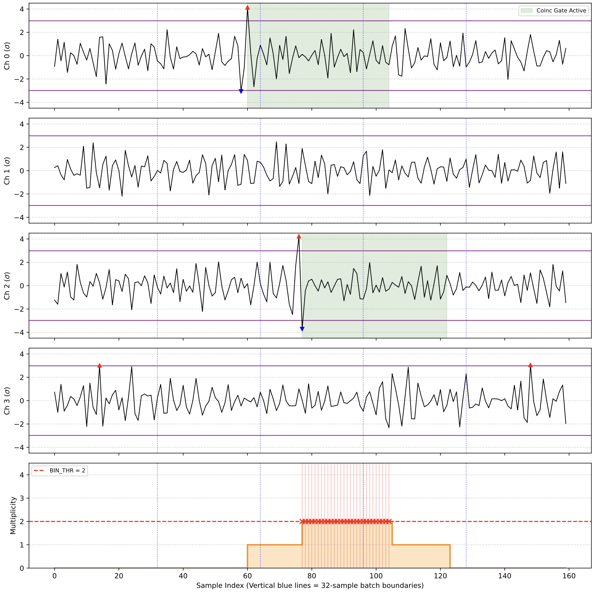

# Hi-Lo Trigger
[](LICENSE)

## Introduction
A Hi-Lo Pre-Trigger for ARIANNA, a neutrino experiment. This is a submodule for the whole DAQ System. This module is a 4-channel VHDL-based trigger logic designed to identify coincident signal events across a 32-sample window(configurable). It utilizes a bipolar thresholding mechanism and configurable temporal stretching to determine event multiplicity.

### RTL Source Files

| File | Entity | Description |
| :--- | :--- | :--- |
| `PRE_TRIGGER_PKG.vhd` | — | Shared type package (`adc_data4_type`, `gate4_type`, `mult4x32_type`, `carry4_type`, etc.) |
| `Pre_trigger_1ch.vhd` | `PRE_TRIGGER_1CH` | Per-channel bipolar threshold + sliding-window gate |
| `Pre_trigger.vhd` | `PRE_TRIGGER` | Top-level: 4× `PRE_TRIGGER_1CH` + coincidence smear + `MULT2BIN` |
| `Mult_to_bin.vhd` | `MULT2BIN` | Combinational multiplicity threshold (count ≥ `BIN_THR`) |

### Top-Level Port Interface (`PRE_TRIGGER`)

| Port | Direction | Width | Description |
| :--- | :--- | :--- | :--- |
| `CLK` | in | 1 | System clock |
| `RESET` | in | 1 | Active-high synchronous reset |
| `DATA_STR` | in | 1 | Data strobe — processing only occurs when asserted |
| `ADC_DATA4` | in | 4 × 32 × 12 b | 12-bit signed ADC samples for 4 channels (sample 31 = newest) |
| `THRESH` | in | 12 b | Absolute threshold; compared as `> +THRESH` and `< -THRESH` |
| `HILO_WINDOW` | in | 5 b | Hi-Lo coincidence window, 0–16 samples (hardware-clamped) |
| `COINC_WINDOW` | in | 6 b | Temporal smearing window, 0–32 samples (hardware-clamped) |
| `BIN_THR` | in | 4 b | Minimum active-channel count to assert `PRE_TRIG` |
| `PRE_TRIG` | out | 1 | Asserted if any time bin meets the multiplicity threshold |

### Core Functional Logic
The system operates through a three-stage pipeline to process ADC data. All stages are clocked; processing is gated by `DATA_STR` and stalls (outputs cleared) when it is de-asserted.

1. **Bipolar Thresholding (`PRE_TRIGGER_1CH`)**
Each of the 4 channels independently compares 12-bit signed ADC samples against a positive threshold (`THRESH`) and its negative equivalent (`-THRESH`).
A sliding window of `HILO_WINDOW` samples (hardware-clamped to ≤ 16) is applied independently to the hi-over-threshold and lo-over-threshold bit vectors.
Both windows include **cross-batch carry-over**: if a threshold crossing occurs near the end of a 32-sample batch, the active window state (`carry_count_hi_d` / `carry_count_lo_d`) is carried into the next batch.
A logical AND of the two stretched vectors produces the `GATE` output, which is active only when both a high and a low threshold crossing have occurred within the configured window.

2. **Temporal Coincidence Smearing (`PRE_TRIGGER`)**
The `GATE` signal from each channel is stretched using a second sliding window, `COINC_WINDOW` (hardware-clamped to ≤ 32 samples), computed in parallel across all 32 time bins.
A per-channel carry register (`coinc_d`) propagates the active window state across batch boundaries, preventing event loss at the 32-sample boundary.
`DATA_STR` is pipelined by one cycle (`data_str_d`) to align with the registered `gate4` outputs from Stage 1.

3. **Multiplicity Evaluation (`MULT2BIN`)**
For every individual time bin (0 to 31), the system aggregates the coincidence bits from all 4 channels into a 4-bit multiplicity vector (`mult4x32_type`). The `MULT2BIN` module is **purely combinational**: it counts the number of active channels and asserts `TRIG` when `count ≥ BIN_THR`. A global `PRE_TRIG` is asserted if any of the 32 per-bin `TRIG` signals is high.

### Technical Specifications

| Parameter | Specification |
| :--- | :--- |
| **Channel Count** | 4 Channels |
| **Batch Size** | 32 samples per clock cycle |
| **ADC Resolution** | 12-bit signed |
| **Hi-Lo Window** | 0 to 16 samples (hardware-clamped, 5-bit input) |
| **Coincidence Window** | 0 to 32 samples (hardware-clamped, 6-bit input) |
| **Multiplicity Threshold** | Configurable 0–4 via `BIN_THR` (4-bit) |
| **Cross-Batch Carry** | Both Stage 1 (hi/lo) and Stage 2 (coincidence) |

## Simulator and Plotting

The plots below are generated by the RTL Boolean emulation and trigger analysis scripts applied to large-scale thermal noise datasets.

### Noise Characterization



The thermal noise is characterized from 1,024,000 samples. Both linear and log-scale plots confirm a zero-mean Gaussian with σ ≈ 1.006, validating the unit-normal assumption used to set threshold levels in units of σ.

### False Trigger Analysis

The following plots show false trigger events captured under different SNR and `BIN_THR` settings. Each plot displays 4 channel waveforms (in units of σ), the active coincidence gate windows (green shading), and the per-bin multiplicity panel with the `BIN_THR` dashed line.

**SNR 3.0, BIN_THR = 1** — Single-channel false trigger (Event 2, Chunk 0)



Only Ch 1 fires a coincidence gate. With `BIN_THR=1`, a single active channel is sufficient to assert `PRE_TRIG`, making this configuration highly sensitive but prone to thermal noise false triggers.

---

**SNR 3.0, BIN_THR = 2** — Two-channel false trigger (Event 112, Chunk 0)



Ch 0 and Ch 2 independently cross both hi and lo thresholds within their `HILO_WINDOW`, and their coincidence gates overlap in time. The multiplicity exceeds `BIN_THR=2` over ~65 samples, causing a false trigger.

---

**SNR 4.0, BIN_THR = 2** — Two-channel false trigger at higher SNR (Event 9702, Chunk 10)



At SNR 4.0 the same two-channel false trigger pattern still occurs, but far less frequently (event 9702 vs. 112 at SNR 3.0). Ch 1 and Ch 3 each produce an isolated gate that happens to overlap in time.

---

**First False Trigger — Extended View**



A longer (~160-sample) view of the earliest false trigger in the dataset. Ch 0 and Ch 2 gates overlap from ~sample 75 to ~130, sustaining the multiplicity above `BIN_THR=2` for roughly 30 consecutive bins.

### Data Availability

The data for plotting and analysis are publicly accessible. The large-scale thermal noise dataset are hosted on CERN Box [here](https://cernbox.cern.ch/s/KYnLYat7XXM8pvu) with password `thermal123`.

## License
This project is licensed under the SHL-2.1 License. See the [LICENSE](LICENSE).

---
> Remaining part is for developers. End-users should focus on the above sections only.

## Bender How-To

1. Add source files to your working directory or declare new external IPs, in `Bender.yml`.
2. `Bender Update`.
3. `bender script vivado` for the vivado script.

How to write `Bender.yml`?

```yml
package:
  name: my_project
  description: "Description for this project."
  authors:
    - "Albert <albert@example.com>" # current maintainer
    - "Albert <albert@example.com>" # current maintainer

dependencies:
  # METHODOLOGY FIX: Never track a moving branch like 'main'. 
  # Pin to exact semantic versions or commit hashes to guarantee reproducible builds.
  common_cells: { git: "https://github.com/pulp-platform/common_cells.git", version: 1.37.0 }
  mydep: { git: "git@github.com:pulp-platform/common_verification.git", rev: "<commit-ish>" }
  mydep: { git: "git@github.com:pulp-platform/common_verification.git", version: "1.1" }

sources:
  # Source files grouped in levels. Files in level 0 have no dependencies on files in this
  # package. Files in level 1 only depend on files in level 0, files in level 2 on files in
  # levels 1 and 0, etc. Files within a level are ordered alphabetically.
  # Level 0
  - src/axi_pkg.sv
  # Level 1
  - src/axi_intf.sv
  # Level 2
  - src/axi_atop_filter.sv
  - src/axi_burst_splitter_gran.sv
  - src/axi_burst_unwrap.sv

  - target: synth_test
    files:
      - test/axi_synth_bench.sv

  - target: simulation
    files:
      - src/axi_chan_compare.sv
      - src/axi_dumper.sv
      - src/axi_sim_mem.sv
      - src/axi_test.sv
```
