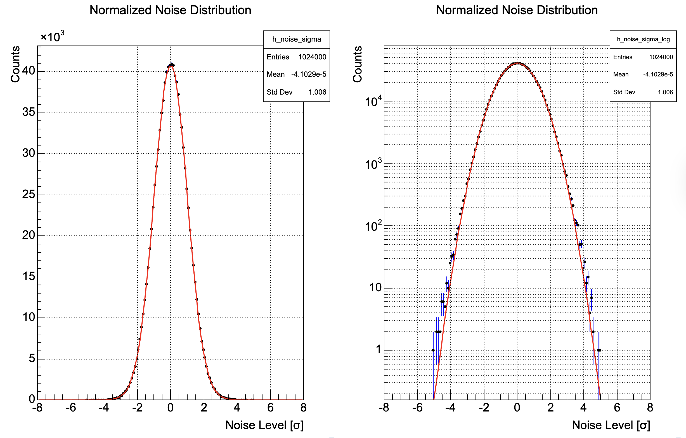
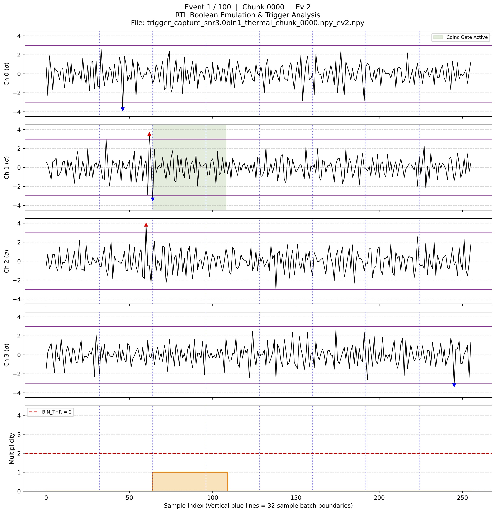
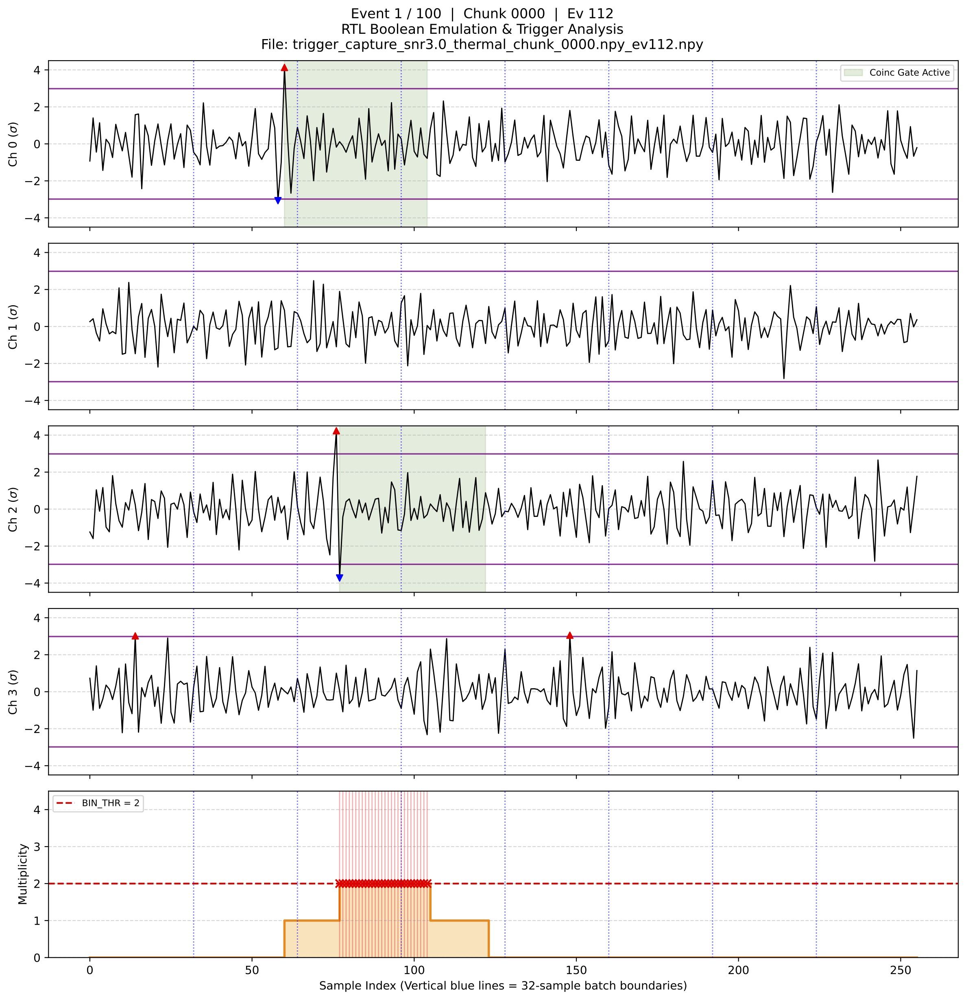
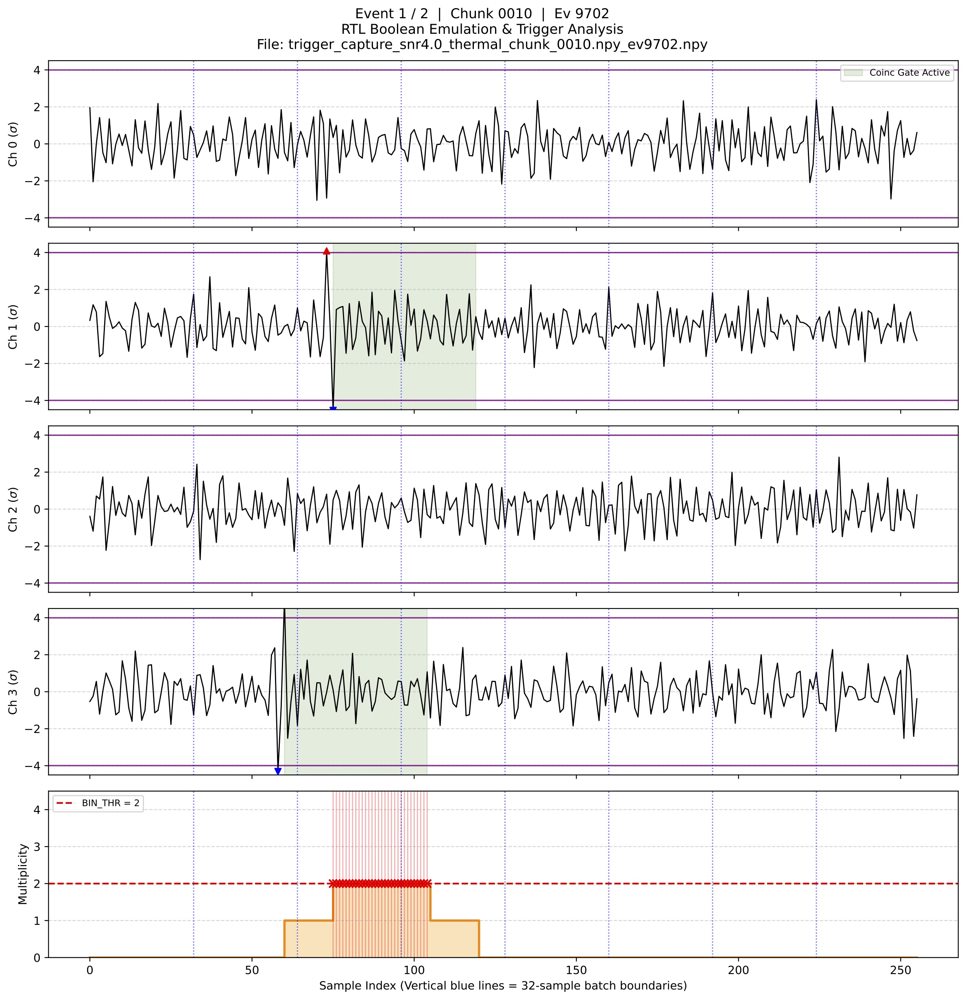
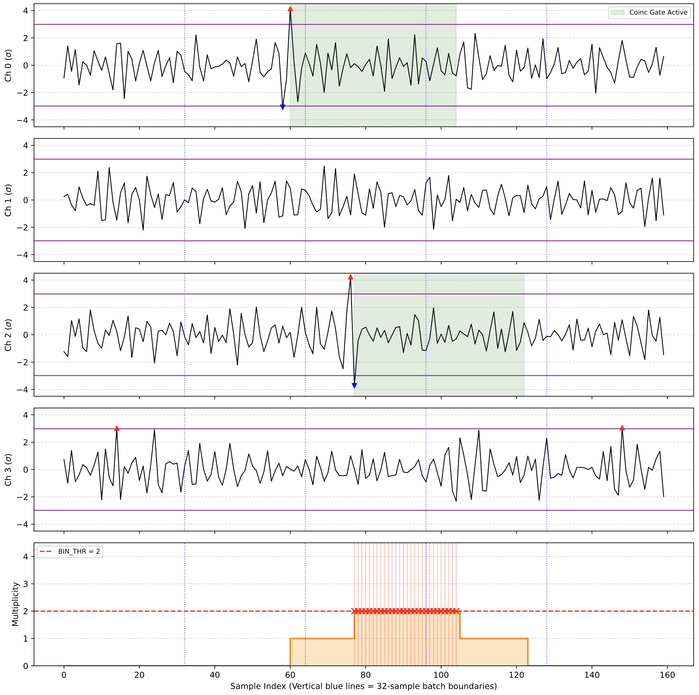

# Hi-Lo Trigger
[](LICENSE)

## Introduction
A Hi-Lo Pre-Trigger for ARIANNA, a neutrino experiment. This is a submodule for the whole DAQ System. This module is a 4-channel VHDL-based trigger logic designed to identify coincident signal events across a configurable sample window. It utilizes a bipolar thresholding mechanism and configurable temporal stretching to determine event multiplicity.

### RTL Source Files

The rtl files are under `hw/rtl/`.

| File | Entity | Description |
| :--- | :--- | :--- |
| `PRE_TRIGGER_PKG.vhd` | — | Single source profile and neutral array types (`adc_ch_data_type`, `gate_type`, `mult_type`, `carry_type`) |
| `Pre_trigger_1ch.vhd` | `PRE_TRIGGER_1CH` | Per-channel bipolar threshold + sliding-window gate |
| `Pre_trigger.vhd` | `PRE_TRIGGER` | Top-level: 4× `PRE_TRIGGER_1CH` + coincidence smear + `MULT2BIN` |
| `Mult_to_bin.vhd` | `MULT2BIN` | Combinational multiplicity threshold (count ≥ `BIN_THR`) |

### Top-Level Port Interface (`PRE_TRIGGER`)

| Port | Direction | Width | Description |
| :--- | :--- | :--- | :--- |
| `CLK` | in | 1 | System clock |
| `RESET` | in | 1 | Active-high asynchronous reset |
| `DATA_STR` | in | 1 | Data strobe — processing only occurs when asserted |
| `ADC_DATA` | in | 4 × N_SAMPLES × 12 b | 12-bit signed ADC samples for 4 channels (newest sample last) |
| `THRESH` | in | 12 b | Signed threshold; strict `> THRESH` / `< -THRESH`, with 12-bit signed negation unchanged |
| `HILO_WINDOW` | in | 8 b | Hi-Lo window, 0–255 accepted samples; no clamp |
| `COINC_WINDOW` | in | 8 b | Coincidence smear, 0–255 accepted samples; no clamp |
| `BIN_THR` | in | 4 b | Minimum active-channel count; standalone `0` still always triggers |
| `PRE_TRIG` | out | 1 | Asserted if any time bin meets the multiplicity threshold |

### Core Functional Logic
There are two registered stages followed by combinational multiplicity logic. An aggregate accepted on a rising edge produces its decision after the following rising edge. The core has no result-valid port: the consumer must align decisions with the accepted aggregate strobe. Strobe gaps clear the corresponding pipeline outputs but retain carry; windows count accepted samples, not idle clock cycles. The standalone `BIN_THR=0` behavior is unchanged, including during idle/reset.

1. **Bipolar Thresholding (`PRE_TRIGGER_1CH`)**
Each of the 4 channels independently compares 12-bit signed ADC samples against a positive threshold (`THRESH`) and its negative equivalent (`-THRESH`).
A sliding window of `HILO_WINDOW` samples (0–255, without clamping) is applied independently to the hi-over-threshold and lo-over-threshold bit vectors.
Both windows include **cross-batch carry-over**: if a threshold crossing occurs near the end of a batch, the active window state (`carry_count_hi_d` / `carry_count_lo_d`) is carried across as many subsequent aggregates as needed.
A logical AND of the two stretched vectors produces the `GATE` output, which is active only when both a high and a low threshold crossing have occurred within the configured window.

2. **Temporal Coincidence Smearing (`PRE_TRIGGER`)**
The `GATE` signal from each channel is stretched using a second sliding window of `COINC_WINDOW` samples (0–255), computed in parallel across all `N_SAMPLES` time bins. `COINC_WINDOW` is a physics parameter independent of `N_SAMPLES` — it reflects the maximum arrival-time difference between channels for a real signal.
A per-channel carry register (`coinc_d`) propagates the active window state across batch boundaries, supporting `COINC_WINDOW` larger than `N_SAMPLES`.
`DATA_STR` is pipelined by one cycle (`data_str_d`) to align with the registered `gate4` outputs from Stage 1.

3. **Multiplicity Evaluation (`MULT2BIN`)**
For every individual time bin (0 to `N_SAMPLES-1`), the system aggregates the coincidence bits from all 4 channels into a 4-bit multiplicity vector (`mult_type`). The `MULT2BIN` module is **purely combinational**: it counts the number of active channels and asserts `TRIG` when `count ≥ BIN_THR`. A global `PRE_TRIG` is asserted if any per-bin `TRIG` signal is high.

### Technical Specifications

| Parameter | Specification |
| :--- | :--- |
| **Channel Count** | 4 Channels |
| **Batch Size** | 16 samples per accepted aggregate; the only v3.0 qualified profile |
| **ADC Resolution** | 12-bit signed |
| **Hi-Lo Window** | 0–255 accepted samples, 8-bit input |
| **Coincidence Window** | 0–255 accepted samples, 8-bit input |
| **Multiplicity Threshold** | 4-bit `BIN_THR`: 0 always triggers, 1–4 count channels, values above 4 cannot trigger |
| **Cross-Batch Carry** | Both Stage 1 (hi/lo) and Stage 2 (coincidence) |

### v3.0 migration boundary

The gateware fork improvements by Rene Reimann (notably `5d9eca1` and `e8940c0`, with subsequent syntax fixes) are recovered into the canonical core. Unlike that integration fork, this release retains **16 samples**, for the existing AI Trigger System four-to-sixteen adapter. No gateware code is changed by this release.

Consumers must rename `ADC_DATA4` to `ADC_DATA`, adopt the neutral package types, and widen both window connections to 8 bits. `PRE_TRIGGER_PKG.vhd` is the single source of `N_SAMPLES=16`, `N_BITS=12`, `N_CHANNEL=4`, and `N_WIN_WIDTH=8`; these are source-time dimensions, not runtime settings or redundant entity generics. Other profiles require separate qualification.

The supported common range (`HILO_WINDOW<=16`, `COINC_WINDOW<=32`) retains v2.2.4 sample-stream behavior. Values outside that range now request real windows instead of being silently clamped. Configuration is held stable during each regression stream; this upgrade does not introduce live configuration switching semantics or new invalid-configuration policy. The existing `MULT2BIN` sensitivity-list warning is unchanged and is not a claim of live `BIN_THR`-only simulation correctness.

## Simulator and Plotting

The plots below are generated by the RTL Boolean emulation and trigger analysis scripts applied to large-scale thermal noise datasets.

### Noise Characterization



The thermal noise is characterized from the first 1000 events.

### False Trigger Analysis

The following plots show false trigger events captured under different SNR threshold and `BIN_THR` settings. Each plot displays 4 channel waveforms (in units of σ), the active coincidence gate windows (green shading), and the per-bin multiplicity panel with the `BIN_THR` dashed line.

**SNR 3.0, BIN_THR = 1** — Single-channel false trigger (Event 2, Chunk 0)



---

**SNR 3.0, BIN_THR = 2** — Two-channel false trigger (Event 112, Chunk 0)



Ch 0 and Ch 2 independently cross both hi and lo thresholds within their `HILO_WINDOW`, and their coincidence gates overlap in time. The multiplicity exceeds `BIN_THR=2` over ~65 samples, causing a false trigger.

---

**SNR 4.0, BIN_THR = 2** — Two-channel false trigger at higher SNR (Event 9702, Chunk 10)



At SNR 4.0 the same two-channel false trigger pattern still occurs, but far less frequently (event 9702 vs. 112 at SNR 3.0). Ch 1 and Ch 3 each produce an isolated gate that happens to overlap in time.

---

**First False Trigger — Extended View**



A longer (~160-sample) view of the earliest false trigger in the dataset. Ch 0 and Ch 2 gates overlap from ~sample 75 to ~130, sustaining the multiplicity above `BIN_THR=2` for roughly 30 consecutive bins.

### Data Availability

The data for plotting and analysis are publicly accessible. The large-scale thermal noise dataset are hosted on CERN Box [here](https://cernbox.cern.ch/s/KYnLYat7XXM8pvu) with password `thermal123`.

## License
This project is licensed under the SHL-2.1 License. See the [LICENSE](LICENSE).

---
> Remaining part is for developers. End-users should focus on the above sections only.

## Bender and qualification

Validated tooling: Bender 0.32.1, GHDL 6.0.0 (LLVM), Python with NumPy; Vivado 2023.2 for the optional standalone route.

```sh
bender update --local
bender script flist -t rtl
python3 scripts/run_ghdl_tests.py
python3 scripts/run_cosim_tests.py
```

The standalone package has no external dependencies, so `Bender.lock` remains `packages: {}`. The `simulation` target includes all four existing testbenches; the runners execute the two directed benches and the repaired file-driven `tb_hilo_trigger`. The historical threshold-sweep `tb_pre_trigger_cosim` is compile-checked, not silently counted as an executed test.

The cosimulation runner reuses the historical stimulus generator, Boolean plotting emulator, and two checked-in Hi-Lo capture files. It checks 16-sample channel-major packing, event-isolation draining, gaps, full-width windows, signed threshold boundaries, unchanged `BIN_THR=0`, and per-aggregate equivalence to original `v2.2.4` RTL in the common range. The local `v2.2.4` tag is required for that comparison. It writes logs, per-case results, and source hashes under `build/cosim`.

For an isolated dynamic-input core route on `xcku5p-ffvb676-2-e`:

```sh
vivado -mode batch -source scripts/run_standalone_ooc.tcl -tclargs build/ooc
```

This separate 250 MHz OOC flow does not use or alter the historical utilization wrapper's 30 ns constraint. It applies zero-delay internal-block boundaries, excludes input-port hold and external reset paths, and checks internal hold, setup, pulse width, routing, and DRC. It is not board validation and does not replace full AI Trigger System qualification.

See [v3.0 qualification](docs/qualification/v3.0/README.md) for the measured results and release boundary. Publish `v3.0.0` before the AI Trigger System consumer runs the scoped `bender update hilo-trigger --fetch`; do not lock the integration release to a moving branch or temporary local path.
